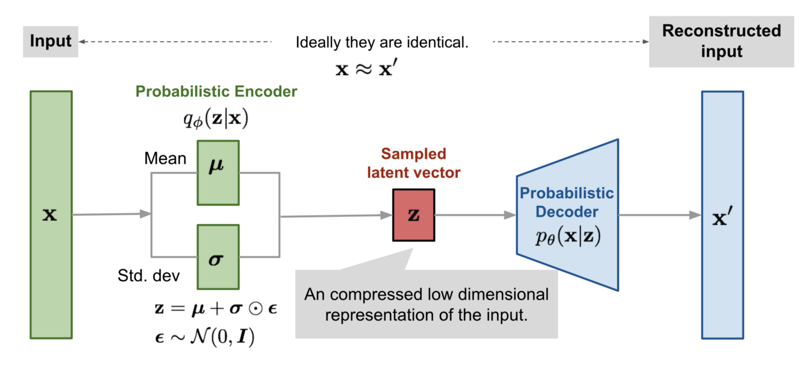
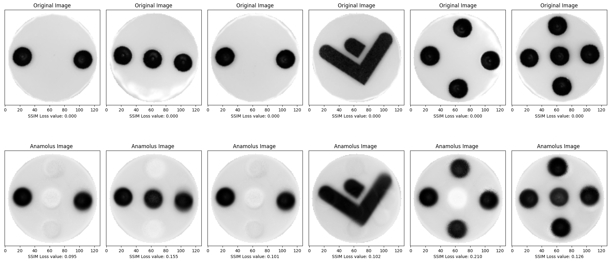

# Variational Auto Encoder

### Reasoning

For all the experiments done so far using AutoEncoders, no instances were found where the model
was actually learning. There are several possible reasons for this that we could ascertain.

Consider that the autoencoder accepts input, compresses it, and then recreates the original 
input. This is an unsupervised technique because all you need is the original data, without 
any labels of known, correct results. No matter how small the bottleneck the autoencoder seemed
to never have any trouble rebuilding the images provided from the latent representation.

We personally believe the most feasible reason is because the dataset is simply not noisy enough.
If there is no noise everything becomes signal and the model can never learn an underlying pattern.

That said the two main uses of an autoencoder are to compress data to two (or three) 
dimensions so it can be graphed, and to compress and decompress images or documents, which 
removes noise in the data. 

Allthough very useful this was not the usecase we were trying to present. Enter: 

### Variational Auto Encoders.

The difference is that a VAE assumes that the source data has some sort of underlying probability 
distribution (such as Gaussian) and then attempts to find the parameters of the distribution. 

You can see that in the VAE plots the data using mean and standard deviation onto a distribution
in the probabilistic encoder part of the model and tries to find patterns in this latent space.

For our purpose the VAE finally gave some good results, using even the most basic model.

When testing on only normal samples the VAE generates a very similar result, and we can even see
in some of the lighter circles that it is aware of the place the circles are usually placed on, each 
dice. 

But it is not until we test on the abnormal samples that we can see the VAE in it's full potential.

The model tries to generate a similar image and it overlays a number of the normal samples over each
other, but can't seem to succeed. The distance between the abnormal and result increases and yields 
far better results.

metric|score
:--------------------------:|:--------------------------:
f1|0.7555555555555555
Accuracy|0.9691011235955056
Precision|0.8947368421052632
Recall|0.6538461538461539