# dice thing

## Installation
- Clone this repository into your local environment with below command-

  `git clone https://github.com/ujjwalk00/anomalous_dice.git`

- Create python virtual environment

- Install all the required library with below command

  `pip install -r requirements.txt`

## Preprocessing Data

We started this project by looking at the data provided. The image dataset contains 6571 images
of dice facing towards the camera. They are 128x128 and divided into 11 classes. Each of the
6 faces has several directions in which they can be oriented. This explains why there are
so many classes.

A first step was to edit these images so they can be divided into only 6 classes. One for each face.
That would in the long run save us inference time of any running model, because less comparisons 
or generations would need to be made for training and predicting.

### Rotations

In order to get these dice facing the correct direction a method was used that draws a line halfway 
along the image and counts the amount of dark pixels. We then rotate the image by 1 degree and repeat.
When doing this for all the diagonals we, in the end, can select the one with the most dark pixels,
and rotate in this way. 


For doing this we had to crop circles out of our images in order to avoid misclassifications with the 
edge of the image.

From these templates were made by squashing the numpy arrays together.

1                           |2                           |3                           |4                           |5                           |6                           |
:--------------------------:|:--------------------------:|:--------------------------:|:--------------------------:|:--------------------------:|:--------------------------:
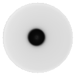||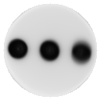|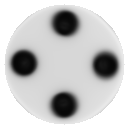||

You can clearly see this approach was not perfect in the last template. This could be solved by adjusting
thresholds but in the interest of saving time it was left to a later stage.

This approach did have an added benefit that anomalies would actually affect the symmetry of the result.
In the following examples you can see that the anomalies are sometimes rotated in a way that differs from 
how normal dice are rotated. When comparing these values to the templates, we can immediately recognize a
number of anomalies without any modeling.

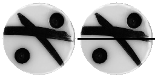


### Thresholds

After this stage images of all classes were compared to the templates and using loss functions the differences
would be calculated for each of these templates. Doing this gave an idea of whithin what range a correct classification 
would be. and these were then used as thresholds in later stages of the project.

This is an example using MSEloss

category 1    |category 2    |category 3    |category 4    |category 5    |category 6    |
:------------:|:------------:|:------------:|:------------:|:------------:|:------------:|
62.02780473883|60.43002574095|66.30725609998|69.93280870737|74.30941474250|82.75002536741|


## Classification

We created classification model to classify dices with different numbers. This is created with the Convolutional Neural Network(CNN).
We started with 1 convolution layer. 
This is how it is performing over each epoc.

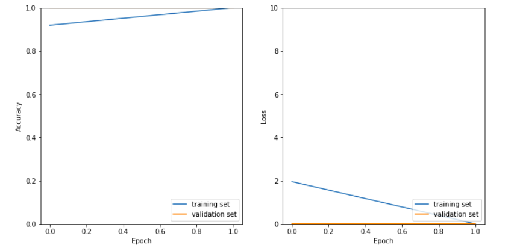

We see from the begining only accuracy was quite high and loss is almost zero for validation data. Which doesn't seem correct in normal case.
So we added 1 more convolution layer with max pooling layer after it.

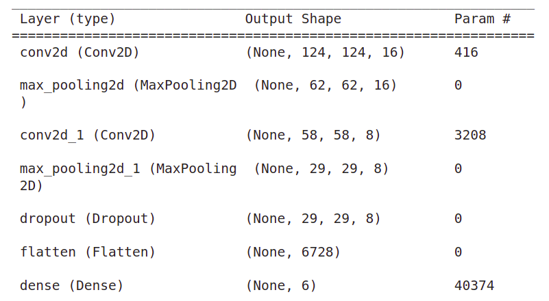

We have used 2 convolutional layers with max pooling layer. we also added dropout layer to tackle with overfitting.
This is how it is performing over each epoc.

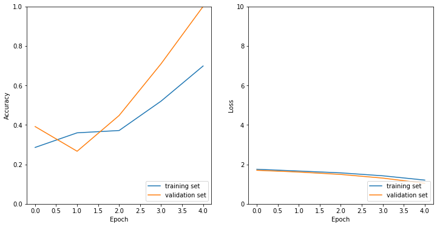


## Anomaly Detection

We tried different approaches for Anomaly Detection.

### Numpy approach

For this approach we relied heavily on the thresholds calculated in the previous chapter.
When a prediction is made on a sample, that sample is compared to each of the thresholds. 
If it falls within the boundaries of one of these it is calculated as a normal sample.

But when a sample like this one is given: 

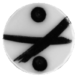

|||||
:--------------------------:|:--------------------------:|:--------------------------:|:--------------------------:|:--------------------------:|:--------------------------:
65.5125 > 62.0278047        |75.4151 > 60.43002574       |67.5423 >66.3072560999      |72.4521 > 69.9328087        |77.5124 > 74.3094147        |91.542 > 82.750025  
MSEloss > thresh 1        |MSEloss > thresh 2        |MSEloss > thresh 3        |MSEloss > thresh 4        |MSEloss > thresh 5        |MSEloss > thresh 6  

And MSEloss for this sample falls outside of the boundaries for each category it is
classified as an anomaly.

metric|score
:--------------------------:|:--------------------------:
f1|0.9051089462333606
Accuracy|0.9051724137931034
ROC|0.9053571428571427
rand_score|0.8268365817091454

### Autoencoder 

We chose to work with an autoencoder because we believed it would be suited to the
task. Rather than using a Generative Adverserial Network we believed an Auto Encoder
would not have to generate an image for each category.

Not only that, but for this challenge it seemed like a novel approach.

An autoencoder is a neural network used to learn efficient codings of unlabeled data. 
The encoding is validated and refined by attempting to regenerate the input from the 
encoding. The autoencoder learns a representation (encoding) for a set of data, 
typically for dimensionality reduction, by training the network to ignore insignificant 
data (“noise”). 


We tried several different architectures using between 1 and 3 dense layers, 2 to 3 
convolutional layers and batch normalization.

For the best approach we created Autoencoder with convolution layers.
This is how it is regenerating images for orginal and anomalies.

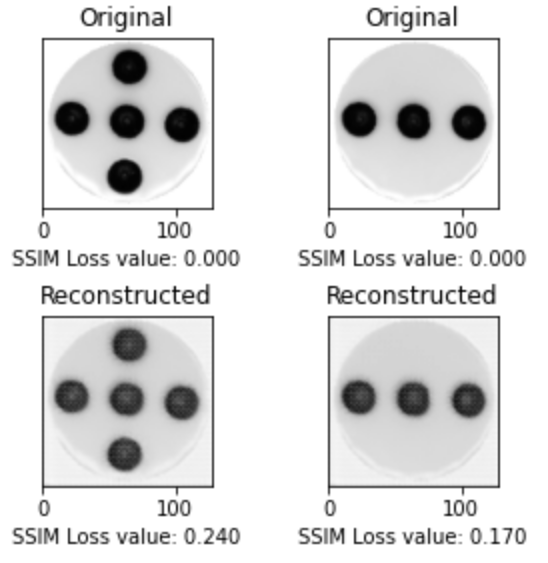
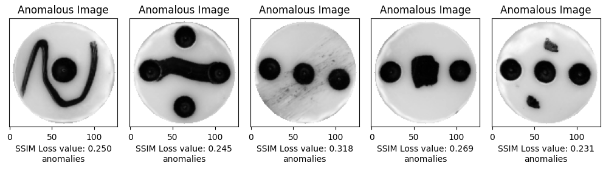
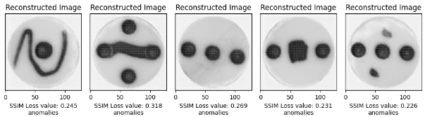

metric|score
:--------------------------:|:--------------------------:
f1 | 0.46808510638297873
Accuracy | 0.9635302698760029
Precision | 0.5789473684210527
Recall | 0.39285714285714285

### Variational Auto Encoder

### Reasoning

For all the experiments done so far using AutoEncoders, no instances were found where the model
was actually learning. There are several possible reasons for this that we could ascertain.

Consider that the autoencoder accepts input, compresses it, and then recreates the original 
input. This is an unsupervised technique because all you need is the original data, without 
any labels of known, correct results. No matter how small the bottleneck the autoencoder seemed
to never have any trouble rebuilding the images provided from the latent representation.

We personally believe the most feasible reason is because the dataset is simply not noisy enough.
If there is no noise everything becomes signal and the model can never learn an underlying pattern.

That said the two main uses of an autoencoder are to compress data to two (or three) 
dimensions so it can be graphed, and to compress and decompress images or documents, which 
removes noise in the data. 

Allthough very useful this was not the usecase we were trying to present. Enter: 

### Variational Auto Encoders.

The difference is that a VAE assumes that the source data has some sort of underlying probability 
distribution (such as Gaussian) and then attempts to find the parameters of the distribution. 

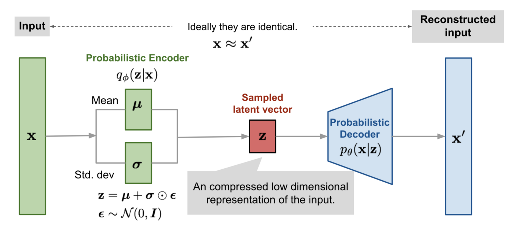

You can see that in the VAE plots the data using mean and standard deviation onto a distribution
in the probabilistic encoder part of the model and tries to find patterns in this latent space.

For our purpose the VAE finally gave some good results, using even the most basic model.

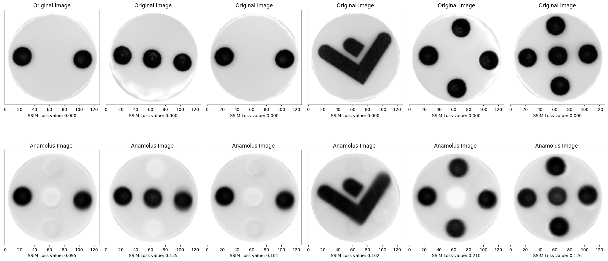

When testing on only normal samples the VAE generates a very similar result, and we can even see
in some of the lighter circles that it is aware of the place the circles are usually placed on, each 
dice. 

But it is not until we test on the abnormal samples that we can see the VAE in it's full potential.

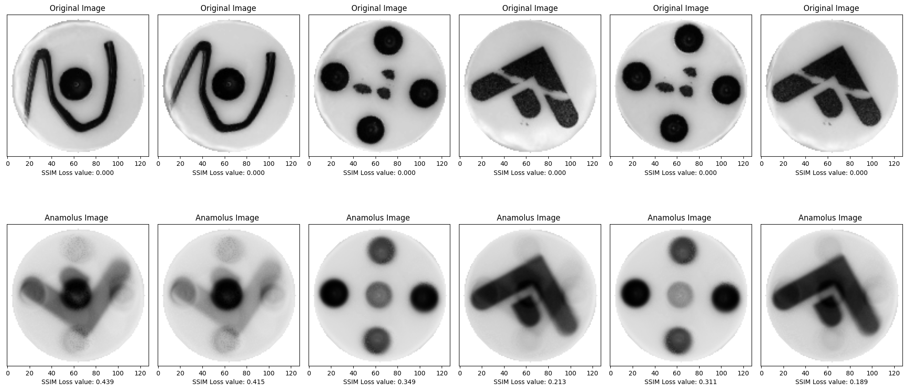

The model tries to generate a similar image and it overlays a number of the normal samples over each
other, but can't seem to succeed. The distance between the abnormal and result increases and yields 
far better results.

metric|score
:--------------------------:|:--------------------------:
f1|0.7555555555555555
Accuracy|0.9691011235955056
Precision|0.8947368421052632
Recall|0.6538461538461539

## Usage

To run application with streamlit run main.py with below command.

  `streamlit run main.py`

Application will open in browser automatically or you can also find application url in terminal like below


# Demo

After running the main.py file you will be directed to the streamlit web app where you can see user inputs for files.  
Make sure the picture is in PNG/JPEG format with the shape of 128x128.

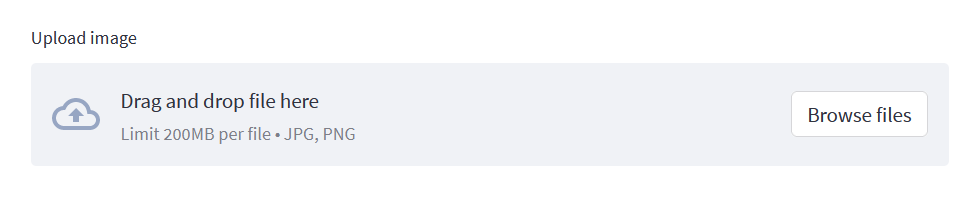

You can find the dice images we are testing with on ```preprocessed_data``` directory and after selecting an image the output looks like this.

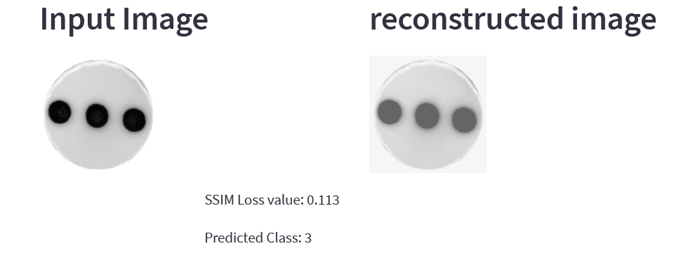

On the first row you can see the input image and the reconstructed image done by autoencoder. As you know we trained the auto encoder with normal dice 
so by the the time we feed anomalous dice to auto encoder it will have a significant loss. This example is with normal dice image and the SSIM loss function 
returns fairly low value and our CNN model that's been trained with normal dice image only. It helps us identify which dice we are looking at. But that is not
enough for anomaly detection let's try with an anomalous dice

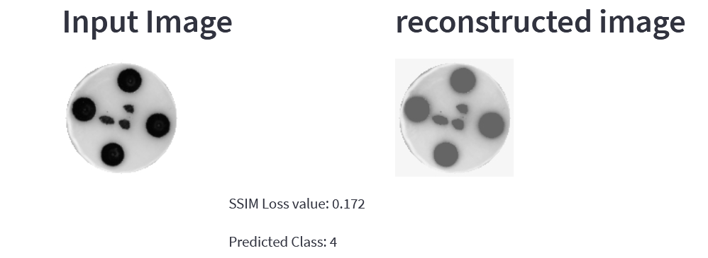

We can see there has been drawn some dots on the middle of the dice. Our SSIM loss function is giving a fairly low loss value and our CNN is identifying it as 
dice 4. How can we make a validation whether it is anomalous or not? Take a look at following image

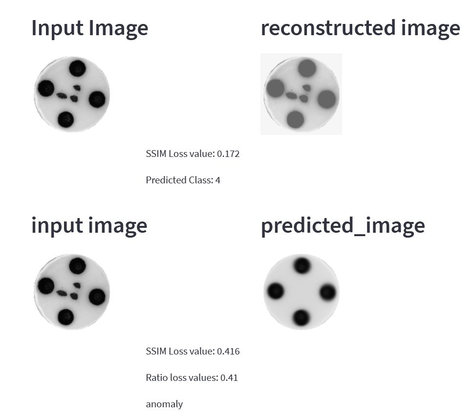

After identifying which dice it is we are going to calculate the loss value between the input image and the template image of the predicted dice. The division between
the first loss value and the second loss value is the key to detect anomalous dices. We are setting the treshold on 0.70, if it's above 0.70 then the similarity rate is
high, meaning its a normal dice. When the ratio is below 0.70 then we identify it as a anomalous dice.

## Collaborators

Design and construction phase of the project was made by 3 collaborators.([Ujjwal Kandel](https://github.com/UjjwalKandel2000), [Reena Koshta](https://github.com/reenakoshta10), and [Aubin](https://github.com/manwithplan))
