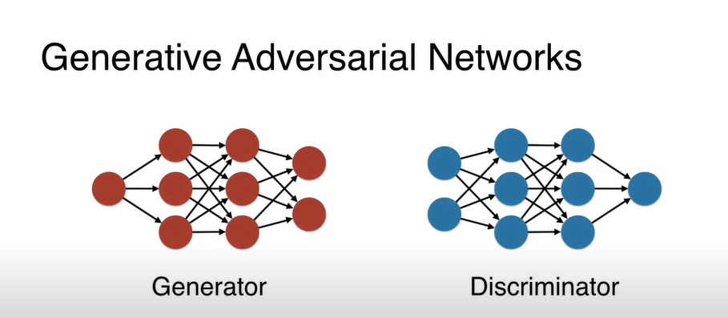

# Anomalious_dice

## What is GAN?
GAN consists of 2 neural networks that contest with each other. One is called generator and the other one discriminator. Generator is constantly trying to make fake images and the  
discriminator is trying catch the fake images. Each time the fake image is caught by discriminator the Generator keeps improving the images untill the fake image is so good  
that the discriminator cannot detect the differences.  

In the language of neural networks it looks like this.  

