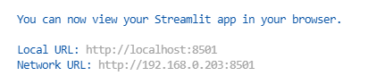
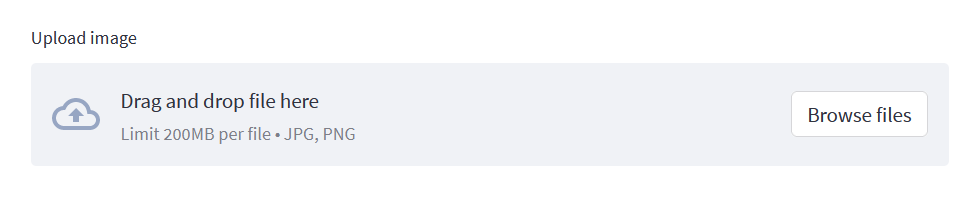
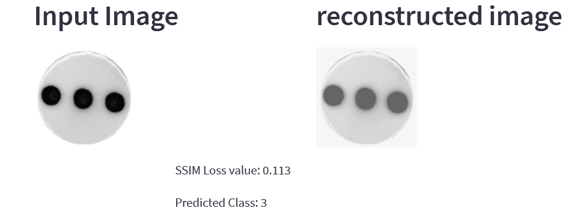
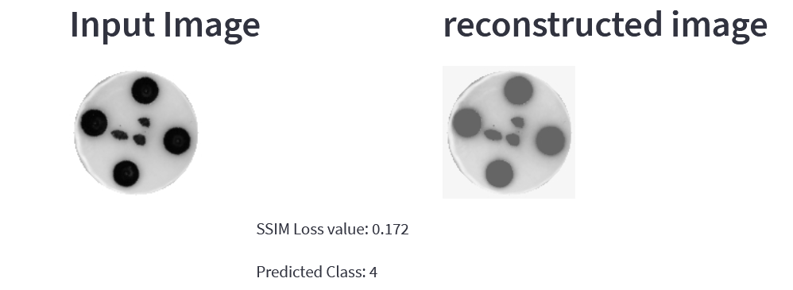
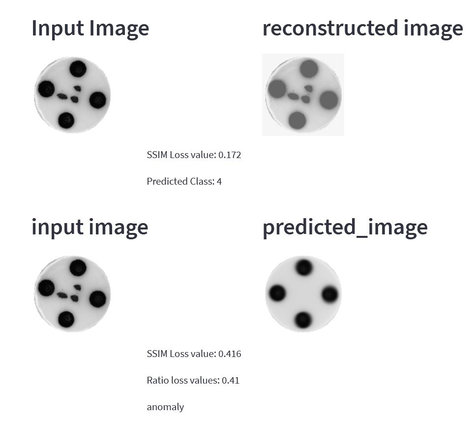

# Installation
- Clone this repository into your local environment with below command-

  `git clone https://github.com/ujjwalk00/anomalous_dice.git`

- Create python virtual environment

- Install all the required library with below command

  `pip install -r requirements.txt`

# Usage

To run application with streamlit run main.py with below command.

  `streamlit run main.py`

Application will open in browser automatically or you can also find application url in terminal like below




# Demo

After running the main.py file you will be directed to the streamlit web app where you can see user inputs for files.  
Make sure the picture is in PNG/JPEG format with the shape of 128x128.



You can find the dice images we are testing with on ```preprocessed_data``` directory and after selecting an image the output looks like this.



On the first row you can see the input image and the reconstructed image done by autoencoder. As you know we trained the auto encoder with normal dice 
so by the the time we feed anomalous dice to auto encoder it will have a significant loss. This example is with normal dice image and the SSIM loss function 
returns fairly low value and our CNN model that's been trained with normal dice image only. It helps us identify which dice we are looking at. But that is not
enough for anomaly detection let's try with an anomalous dice



We can see there has been drawn some dots on the middle of the dice. Our SSIM loss function is giving a fairly low loss value and our CNN is identifying it as 
dice 4. How can we make a validation whether it is anomalous or not? Take a look at following image



After identifying which dice it is we are going to calculate the loss value between the input image and the template image of the predicted dice. The division between
the first loss value and the second loss value is the key to detect anomalous dices. We are setting the treshold on 0.70, if it's above 0.70 then the similarity rate is
high, meaning its a normal dice. When the ratio is below 0.70 then we identify it as a anomalous dice.


